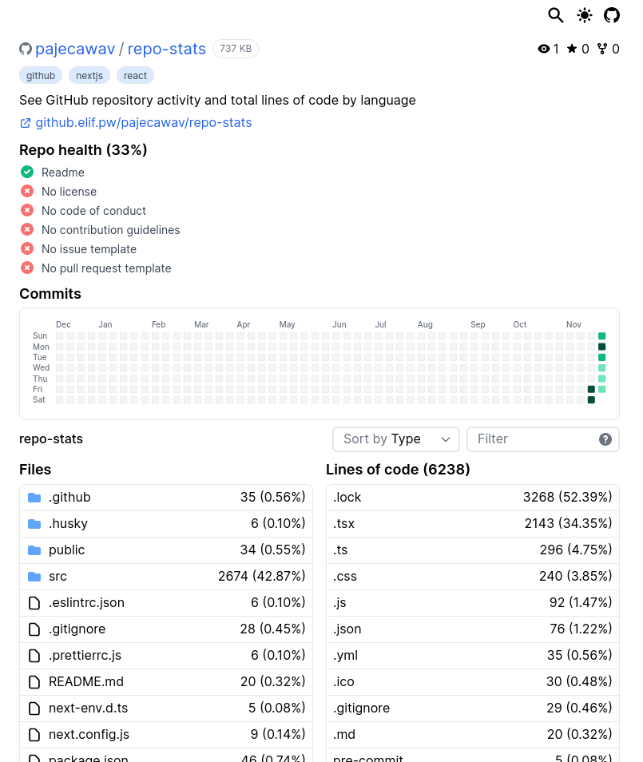

# Repo Stats

A [website](https://github.elif.pw/) to display GitHub repository stats. Currently the following information is available:

-   Total repo size
-   Repo health calculated by GitHub (`README.md`, license, etc)
-   Repo commit activity for the past year
-   Total lines of code in files by file extension. Supports navigation, preview of text files and files filtering. LOCs data is provided by [ghloc](https://github.com/subtle-byte/ghloc).

Also a [Firefox addon](https://addons.mozilla.org/ru/firefox/addon/github-lines-of-code/) is available. It provides LOCs stats dropdown directly on project's GitHub page and a link to page with detailed stats for the repository. Source code available [here](https://github.com/pajecawav/ghloc-extension/).

## Current Limitations

-   LOCs API has a max repo size limit.

## Development

1. Clone the repository: `git clone https://github.com/pajecawav/repo-stats`.
1. Install dependencies: `yarn install`.
1. Start development server: `yarn dev`.
1. Navigate to `localhost:3000`.

To build the project run `yarn build`.
